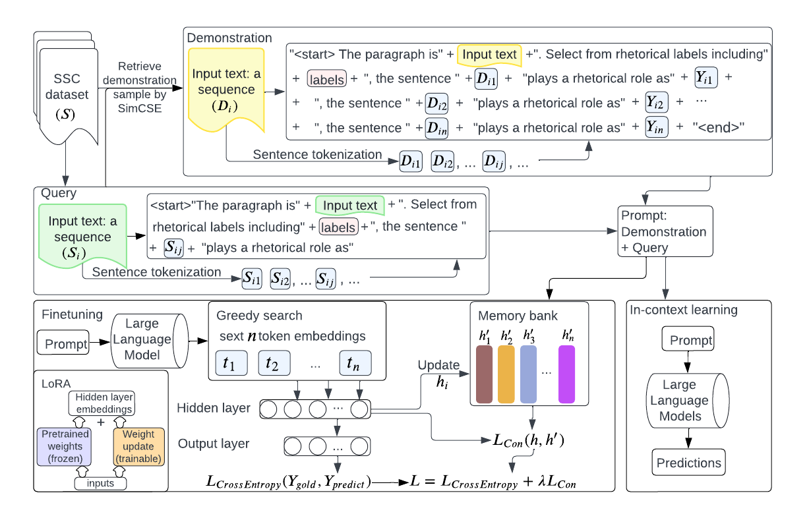

# LLm-SSC
This repository is the official implementation of [Multi-label Sequential Sentence Classification via Large Language Model](...) (EMLNP 2024 Findings) .

 


## Environment

Create a conda environment by: 
```
conda env create -f environment.yml
```
## In-context learning for sequential sentence classification - multi-label

You can run the following command to test the multi-label in-context learning for sequential sentence classification using the dataset BIORC800: 

```
python .\prompt_in_context_learning_multilabel.py
```
To use different number of shots, you can specify the "sample_count" parameter. 

## In-context learning for sequential sentence classification - single-label

You can run the following command to test the single-label in-context learning for sequential sentence classification using the dataset CS-ABSTRACT. Please download the CS-ABSTRACT dataset, change the data format, and put the dataset under the dataset_llm directory before running the following command: 

```
python .\prompt_in_context_learning.py
```
To use different number of shots, you can specify the "sample_count" parameter. To use other single-label sequential sentence classification datasets, you can specify the "--dataset" parameter (choose from csabstract, pubmed_20k, and art_coresc) and the "--start_from_memory_bank_path" parameter. 


## Train multi-label sequential sentence Classifier

You can run the following command to train and test the muli-label LLM-SSC model using the dataset BIORC800: 

```
python .\peft_tuning_with_space_thinking_with_no_additional_info_multi_label.py --start_from_memory_bank_path="biorc800_best.pickle" --contrastive_mode=“weighcon”
```

To use different contrastive learning loss, you can specify the "contrastive_mode" parameter (choose from weighcon and herocon).

## Train single-label sequential sentence Classifier

You can run the following command to train and test the muli-label LLM-SSC model using the dataset CS-ABSTRACT. Please download the CS-ABSTRACT dataset, change the data format, and put the dataset under the dataset_llm directory before running the following command: 

```
python .\peft_tuning_with_space_thinking_with_no_additional_info.py --start_from_memory_bank_path=“csabstract_best.pickle" --start_from_memory_bank=True --contrastive_mode=“herocon” 
```

To use other single-label sequential sentence classification datasets, you can specify the "--dataset" parameter (choose from csabstract, pubmed_20k, and art_coresc) and the "--start_from_memory_bank_path" parameter. 
